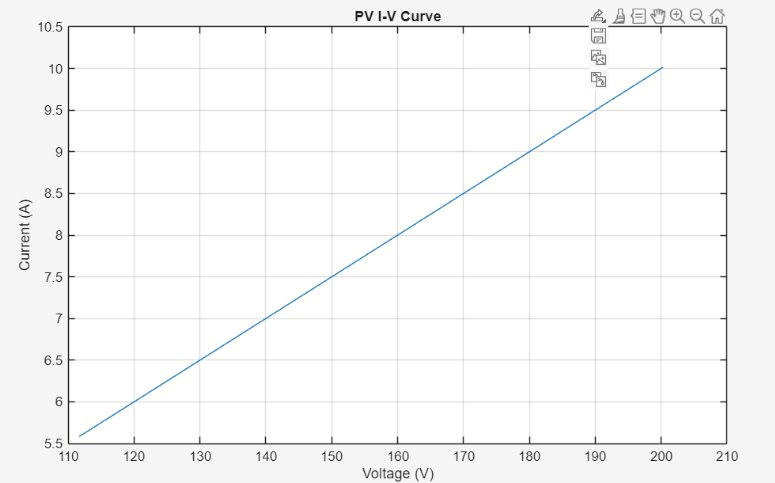
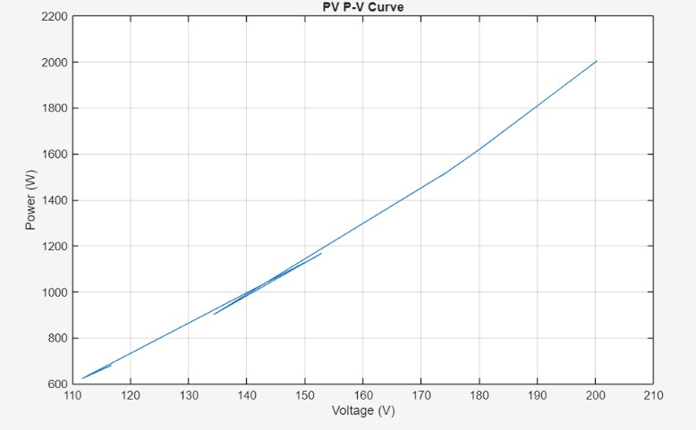
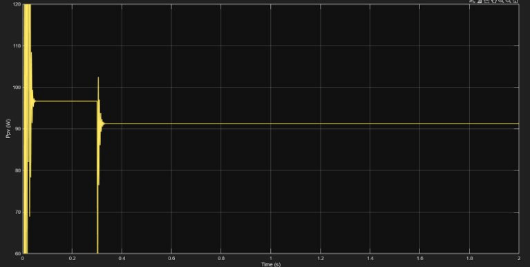
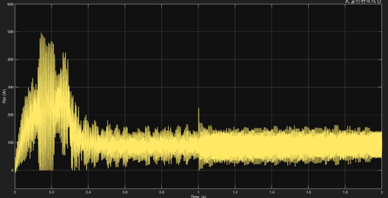
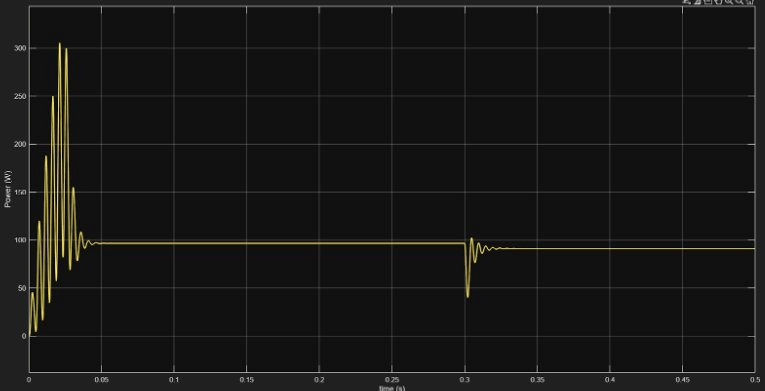
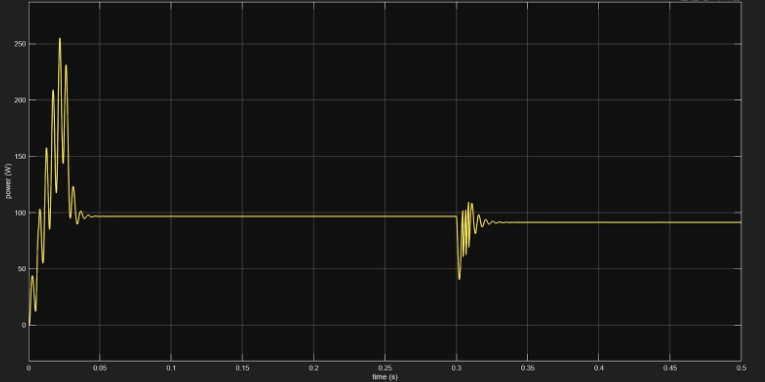

# Solar PV System with DC-DC Boost Converter and MPPT Optimization
## P&O vs Incremental Conductance — Simulation & Analysis

Designed and simulated a complete solar PV system with DC-DC boost converter and MPPT control using MATLAB R2025b / Simulink / Simscape Electrical (Specialized Power Systems). Implements and compares Perturb & Observe (P&O) and Incremental Conductance (IncCond) algorithms under step-changing irradiance conditions across a modular, phase-by-phase development approach.

---

## System Architecture
```
PV Array → Input Capacitor → Boost Converter → Load
                                    ↑
                                   PWM
                                    ↑
                            MPPT Controller
                          (P&O or IncCond)
```

---

## Development Phases

| Phase | What Was Built | Key Outcome |
|-------|---------------|-------------|
| Phase 1 | PV Array Modelling | I-V and P-V characteristics validated |
| Phase 2 | DC-DC Boost Converter | Voltage step-up 54.7V → ~108V confirmed |
| Phase 3 | P&O MPPT Integration | Dynamic duty cycle, MPP tracking achieved |
| Phase 4 | With vs Without MPPT | MPPT essential fixed D produces chaos |
| Phase 5 | P&O vs IncCond Comparison | IncCond shows superior steady-state performance |

---

## PV Array Parameters

| Parameter | Value |
|-----------|-------|
| Module | SunPower SPR-305E-WHT-D |
| Parallel strings | 2 |
| Series modules per string | 10 |
| Voc (per module) | 21 V |
| Isc | 5 A |
| Vmp (per module) | 17 V |
| Imp | 4.5 A |
| Max power per module | 76.5 W |
| Operating temperature | 25°C |
| Irradiance profile | 1000 → 800 W/m² at t=0.5s → 600 W/m² at t=1.0s |

---

## Boost Converter Specifications

| Component | Value |
|-----------|-------|
| Inductor | 1 mH, Rs = 0.01 Ω |
| MOSFET | Ron = 1 mΩ + snubber |
| Diode | Ron = 1 mΩ, Vf = 0V + snubber |
| Output Capacitor | 1000 µF |
| Load Resistor | 50 Ω |
| Switching Frequency | 10 kHz |
| Duty Cycle (fixed test) | D = 0.5 → Vout ≈ 109.4 V |
| Solver | Discrete ode3, 1e-5s |

---

## MPPT Algorithm Comparison

| Metric | P&O | Incremental Conductance |
|--------|-----|------------------------|
| Startup peak overshoot | ~300 W | ~250 W |
| Startup settling time | ~0.05 s | ~0.04 s |
| Steady-state power | ~95–100 W | ~95–100 W |
| Steady-state oscillations | Persistent | Minimal |
| Tracking time after disturbance | ~0.02–0.05 s | ~0.02–0.04 s |
| Recovery quality | More oscillations | Cleaner, faster |
| Implementation complexity | Low | Medium |
| Best suited for | Cost-sensitive systems | High efficiency systems |

---

## Key Results

> **Without MPPT (fixed D = 0.6):** Power oscillates chaotically between 0–500 W, never stabilises
>
> **With P&O MPPT:** Power recovers to 85–91 W within 0.02–0.05 s after disturbance
>
> **IncCond vs P&O:** Same MPP reached, IncCond gets there with less oscillation and stays cleaner

---

## Repository Structure
```
Solar-PV-MPPT-System/
├── Models/
│   ├── PV_Model.slx              # Phase 1 — PV array characterisation
│   ├── Boost_Convertor.slx       # Phase 2 — fixed duty cycle boost
│   ├── MPPT_PnO.slx              # Phase 3 — P&O MPPT controlled
│   ├── MPPT_No_Control.slx       # Phase 4 — fixed D=0.6, no MPPT
│   └── MPPT_IncCond.slx          # Phase 5 — Incremental Conductance
├── Results/
│   ├── IV_curve.png
│   ├── PV_curve.png
│   ├── Ppv_MPPT.png
│   ├── Ppv_noMPPT.png
│   ├── PnO_MPPT_comp.png
│   └── IncCond_MPPT_comp.png
├── Report/
│   └── Solar_PV_MPPT_Report.pdf
└── README.md
```

---

## Test Conditions

- Irradiance: 1000 → 600 W/m² step at t = 0.3 s (Phase 3/4/5)
- Irradiance: 1000 → 800 → 600 W/m² two-stage (Phase 1)
- Temperature: 25°C constant
- Stop time: 2 s
- Solver: Discrete ode3, fixed step 1e-5 s

---

## Models

| Phase | File | Description |
|-------|------|-------------|
| Phase 1 | [PV_Model.slx](Models/PV_Model.slx) | PV array characterisation — I-V and P-V curves |
| Phase 2 | [Boost_Convertor.slx](Models/Boost_Convertor.slx) | Fixed duty cycle boost — voltage step-up validation |
| Phase 3 | [MPPT_PnO.slx](Models/MPPT_PnO.slx) | P&O MPPT controlled system |
| Phase 4 | [MPPT_No_Control.slx](Models/MPPT_No_Control.slx) | No MPPT — fixed D=0.6 for comparison |
| Phase 5 | [MPPT_IncCond.slx](Models/MPPT_IncCond.slx) | Incremental Conductance MPPT |

---

## Tools Used

- MATLAB R2025b / Simulink
- Simscape Electrical — Specialized Power Systems (SPS)
- MATLAB Function blocks (custom MPPT algorithms)
- PWM Generator (DC-DC)

---

## Results

### I-V Curve


### P-V Curve


### PV Power — With MPPT (P&O)


### PV Power — Without MPPT (Fixed D=0.6)


### P&O MPPT — Algorithm Comparison


### Incremental Conductance - Algorithm Comparison

---

## Report

Full simulation report — theory, methodology, results, and algorithm comparison:

[Solar_PV_MPPT_Report.pdf](Report/Solar_PV_MPPT_Report.pdf)

---

## Author

**Arushi Katiyar**
GitHub: [@arushi1604](https://github.com/arushi1604)
